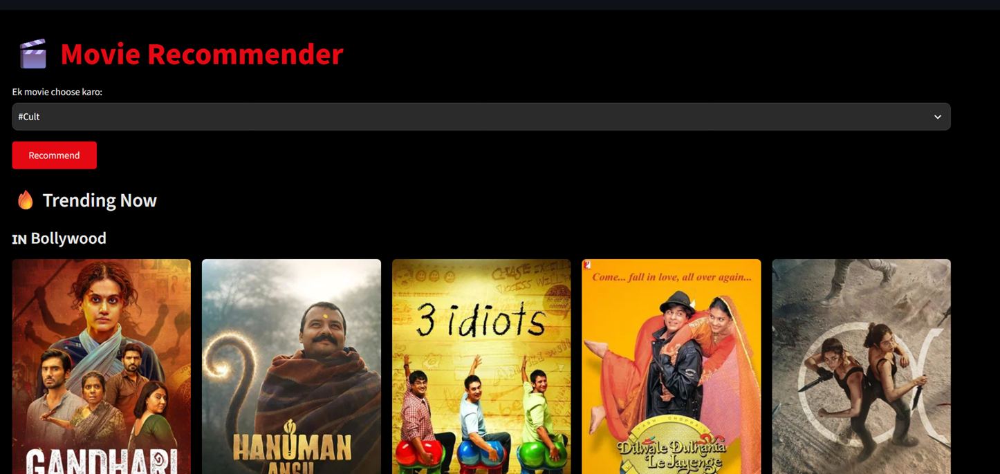
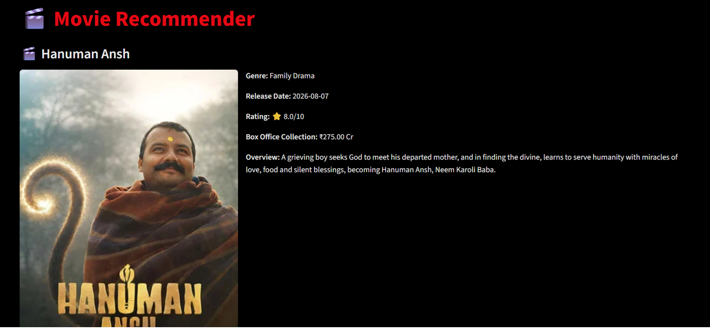

# 🎬 Movie Recommender

A content-based movie recommendation web app covering Bollywood, Hollywood, and South Indian cinema, powered by live data from the TMDB API.

## Features

- Content-based recommendations using genres and keywords (CountVectorizer + cosine similarity)
- Movies from Bollywood, Hollywood, and South Indian cinema
- Click on a poster to view full details — overview, rating, release date, box office collection (in INR), and a Hit/Superhit/Flop verdict
- Netflix-style dark UI
- "Trending Now" section, split by industry

## Tech Stack

- Python
- Streamlit (web UI)
- pandas + scikit-learn (recommendation logic)
- TMDB API (movie data)

## Local Setup

1. Clone the repository:
   ```
   git clone <your-repo-url>
   cd <repo-folder>
   ```

2. Install dependencies:
   ```
   pip install -r requirements.txt
   ```

3. Get a free TMDB API key: https://www.themoviedb.org/settings/api

4. Create a `.streamlit/secrets.toml` file and add:
   ```
   TMDB_API_KEY = "your_key_here"
   ```

5. Run the app:
   ```
   streamlit run main.py
   ```

On the first run, the app fetches movies from TMDB (this takes a little time) and saves them to `movies.csv`. Subsequent runs load instantly from this cached file.

## Live Demo

<!-- Add your Streamlit Cloud link here after deploying -->
[Live App](your-streamlit-link-here)

## Screenshots





<!-- Save your screenshot images inside a "screenshots" folder in the project,
     and update the file names above to match yours. -->

## How It Works

1. Popular Hollywood, Bollywood, and South Indian movies are fetched from the TMDB API (parallelized for speed)
2. Each movie's genre and keywords are combined into a single "tag"
3. `CountVectorizer` converts these tags into numeric vectors
4. `cosine_similarity` measures how similar movies are to one another
5. When a user selects a movie, the 5 most similar movies are recommended
